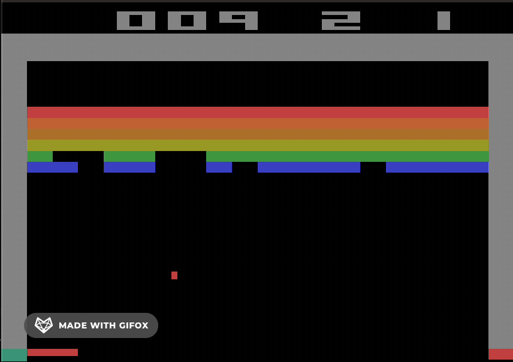

# Deep Q-Network (DQN) Implementation and Upgrades

## Introduction

*Make sure to read the report from the repository for more details about the project [report.pdf](report.pdf).*

This project re-implements and enhances the Deep Q-Network (DQN) by Mnih et al. (2015). We replicated the DQN with modifications for computational constraints and integrated components from the Rainbow algorithm, such as dueling networks, prioritized experience replay, n-step returns, and noisy networks. Evaluations against a random action baseline showed significant performance improvements, demonstrating the effectiveness of these enhancements.

## Motivation

Our goal was to deepen our understanding of reinforcement learning and deep learning by reimplementing the DQN and integrating Rainbow components. This allowed us to explore foundational mechanics and evaluate the impact of advanced RL techniques.

### Environment

- **Game**: Atari 2600 Breakout
- **Reason**: Manageable complexity and availability of comparative metrics.

### Baseline Comparison

To ensure that improvements are meaningful and not due to environmental dynamics, we compared the agent's performance to a random action baseline.

## Upgrades Using Rainbow Components

We enhanced the original DQN implementation by integrating several components from the Rainbow algorithm:

1. **Double DQN**: Addresses overestimation bias by decoupling action selection and evaluation.
2. **Dueling Network Architecture**: Separates the estimation of state value and advantage for each action.
3. **Prioritized Experience Replay**: Samples important transitions more frequently based on temporal-difference (TD) error.
4. **N-Step Returns**: Uses multi-step returns for better learning from delayed rewards.
5. **Noisy Networks**: Adds stochasticity to network weights to improve exploration.

## Results

### Performance Metrics

The enhanced DQN showed improved performance over the classic DQN and significantly outperformed the random action baseline. The results demonstrate the effectiveness of integrating advanced components from the Rainbow algorithm.

## Repository Structure

- [`/notebooks/`](notebooks/): Jupyter notebooks containing the code for each version of the implementation.
- [`/checkpoints/`](checkpoints/): Saved model checkpoints at different timesteps during training.
- [`/data/`](data/): Plot data and logs generated during training.
- [`/report.pdf`](report.pdf): The full report detailing the implementation and results.

## References

- Mnih, V., et al. (2015). *Human-level control through deep reinforcement learning*. Nature.
- Hessel, M., et al. (2018). *Rainbow: Combining improvements in deep reinforcement learning*. AAAI Conference.

## Acknowledgments

We would like to thank the authors of the original papers for their foundational work in reinforcement learning and deep learning.