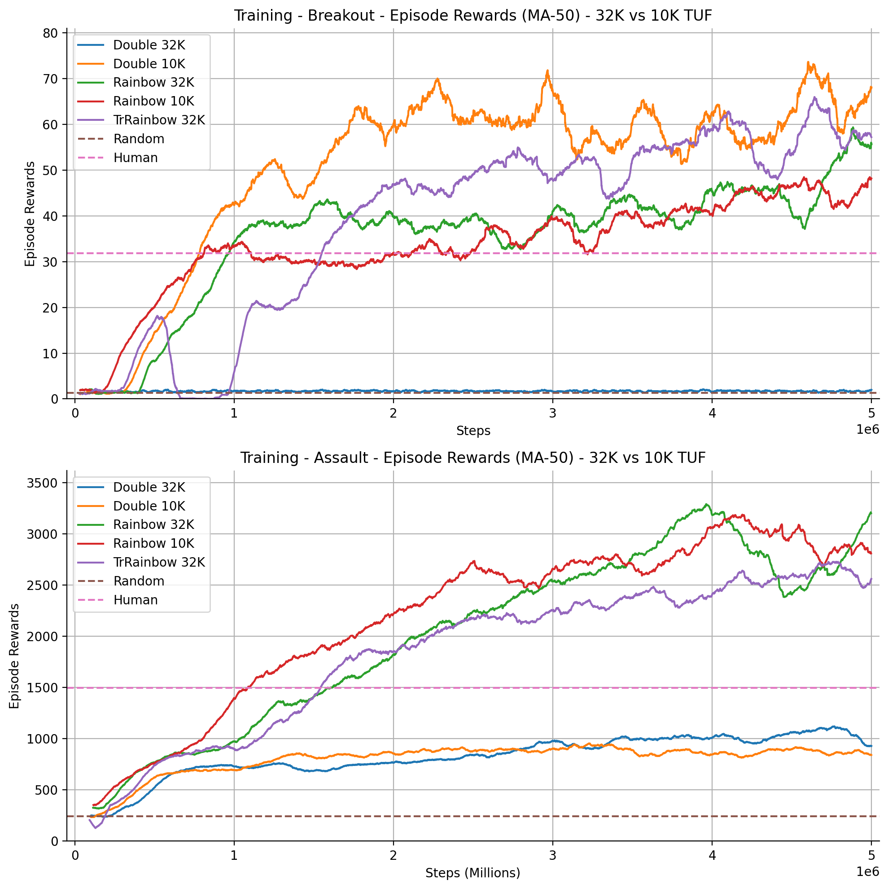

# Rainbow DQN Reimplementation: Results & Technical Overview

<p align="center">
  
  
</p>

## Introduction

This project reimplements key components of the Rainbow DQN architecture to train reinforcement learning agents for Atari games, specifically focusing on training efficiency using limited resources (Apple Silicon M3 Pro with 18 GB unified memory). Atari 2600 games are used as benchmarks to test the performance of reinforcement learning algorithms with high-dimensional inputs (raw pixels). The goal is to demonstrate that meaningful DRL research can be achieved without massive computational resources.

## Key Reimplemented Components


- **Noisy Networks**: Introduce parameterized noise into the network to improve exploration.
- **N-Step Learning**: Uses multi-step returns to provide a richer learning signal, improving long-term planning.
- **Double DQN**: Reduces overestimation bias by separating action selection and evaluation.
- **Dueling Networks**: Splits the estimation of state values and action advantages, enhancing learning efficiency.
- **Distributional DQN**: Models the distribution of rewards, allowing the agent to capture uncertainty in returns.
- **Prioritized Experience Replay**: Samples significant experiences more frequently, speeding up learning.
- We did not implement A2C (for resources and simplicity reasons), but it is included in the Rainbow DQN paper.

### Description of Key Files and Directories:

- **`data/`**: Stores training results, including model checkpoints and logs, organized by target update frequency (`10K_TUF` and `32K_TUF`).
- **`experiments/`**: JSON configuration files for different experiments, organized by training setups like 10K TUF, 32K TUF, and transfer learning.
- **`imgs/`**: Images and graphs for visualizations, such as training curves and game screenshots.
- **`notebooks/`**: Jupyter notebook (`plots.ipynb`) for generating training performance graphs and analysis.
- **`onnx/`**: Models saved in ONNX format for compatibility and exporting (generated on Breakout).
- **`requirements.txt`**: Python dependencies required for the project.
- **`scripts/`**: Core scripts for training and testing:

This structure is designed to keep training, testing, and analysis organized, with clear separation between configuration files, model checkpoints, and utility functions.

## Results

The project explores training models for two games: *Breakout* and *Assault*, comparing **Double DQN** and **Rainbow DQN** across two different target update frequencies (32K and 10K). The Rainbow DQN outperforms Double DQN, especially in the more complex *Assault* game.

### Evaluation Protocol

To assess the performance of our trained agents, we conducted a series of tests under standardized conditions. Each agent was evaluated over 500 episodes, following an initial warm-up phase of 100 episodes. Empirically, this warm-up improved the mean scores by allowing agents to stabilize their performance before formal evaluation.

- **Warm-Up Games:** 100 episodes.
- **Evaluation Games:** 500 episodes with 5 lives per game.
- **Preprocessing:** Identical to the training phase, including frame stacking and environment wrappers.

### Evaluation Metrics

#### Performance After 5 Million Steps

##### Breakout

- **Results with 32K Target Update Frequency (TUF):**

|       Agent | Mean Score | Standard Deviation | Minimum Score | Maximum Score |
| ----------: | :--------: | :----------------: | :-----------: | :-----------: |
|      Random |   1.364    |       1.394        |      0.0      |      7.0      |
|  Double DQN |   2.028    |       2.560        |      0.0      |      9.0      |
| Rainbow DQN |   60.512   |       33.293       |      8.0      |     353.0     |

- **Results with 10K Target Update Frequency:**

|       Agent | Mean Score | Standard Deviation | Minimum Score | Maximum Score |
| ----------: | :--------: | :----------------: | :-----------: | :-----------: |
|      Random |   1.364    |       1.394        |      0.0      |      7.0      |
|  Double DQN |  163.254   |       78.810       |     30.0      |     385.0     |
| Rainbow DQN |   58.594   |       22.192       |     23.0      |     257.0     |

##### Assault

- **Results with 32K Target Update Frequency:**

|       Agent | Mean Score | Standard Deviation | Minimum Score | Maximum Score |
| ----------: | :--------: | :----------------: | :-----------: | :-----------: |
|      Random |   242.382  |       74.342       |      63.0     |     504.0     |
|  Double DQN |  1673.888  |      544.315       |     651.0     |    4158.0     |
| Rainbow DQN |  4883.154  |      2096.328      |     871.0     |    9792.0

- **Results with 10K Target Update Frequency:**

|       Agent | Mean Score | Standard Deviation | Minimum Score | Maximum Score |
| ----------: | :--------: | :----------------: | :-----------: | :-----------: |
|      Random |   242.382  |       74.342       |      63.0     |     504.0     |
|  Double DQN |  2144.93   |      640.198       |     744.0     |    5098.0     |
| Rainbow DQN |  4750.356  |      1852.385      |     776.0     |    9073.0     |
<!-- ##### Performance After 1.5 Million Steps with Transfer Learning and 32K TUF

###### Rainbow DQN on Breakout 

|          Agent | Mean Score | Standard Deviation | Minimum Score | Maximum Score |
| -------------: | :--------: | :----------------: | :-----------: | :-----------: |
|         Random |     -      |         -          |       -       |       -       |
|   From Assault |   38.922   |       11.40        |     13.0      |     79.0      |
| Random Weights |   46.752   |       19.407       |     10.0      |     258.0     |

###### Rainbow DQN on Assault

|          Agent | Mean Score | Standard Deviation | Minimum Score | Maximum Score |
| -------------: | :--------: | :----------------: | :-----------: | :-----------: |
|         Random |     -      |         -          |       -       |       -       |
|  From Breakout |  1078.698  |      296.595       |     651.0     |    2163.0     |
| Random Weights |   1801.4   |      648.836       |     682.0     |    3344.0     | -->

## Environment Wrappers

To enhance learning efficiency and agent performance, we implemented several environment wrappers using the Gymnasium framework:

- **No-Op Reset**: Randomizes the initial game state by executing a random number (1-30) of **NOOP** actions at the start of each episode, promoting robustness.
- **Fire-On-Reset**: Automatically issues a specific action (e.g., **FIRE** in Breakout) upon reset or after a life is lost, ensuring immediate interaction with the environment.
- **Preprocessing of Gym Environment**:
  - **Resizing**: Downscaled frames to 84×84 pixels.
  - **Grayscale Conversion**: Converted RGB images to grayscale.
  - **Normalization**: Scaled images from 255-0 to 1.0-0.0.
- **Frame Skipping**: Repeats the agent's selected action for a fixed number of frames (typically 4), reducing computational load and focusing on longer-term strategies.
- **Frame Stacking**: Stacks the last four frames along the channel dimension (4, 84, 84) to provide temporal context, using **lazy frame stacking** to optimize memory usage.
- **Enhanced Statistics Access**: Exposes additional game statistics (e.g., lives remaining) to improve the agent's ability to detect significant events and assign accurate rewards.
- **Terminal Signal on Life Loss**: Treats life loss as a terminal state (not a reset), providing immediate feedback to the agent about the consequences of its actions.

## Hyperparameters

We carefully selected hyperparameters to optimize the performance of both the Double DQN and Rainbow DQN implementations. They are inspired by the original paper.

| **Hyperparameter**                      | **Double DQN**   | **Rainbow DQN**                                             |
| --------------------------------------- | ---------------- | ----------------------------------------------------------- |
| **Learning Rate**                       | 0.00025          | 0.00025                                                     |
| **Discount Factor (γ)**                 | 0.99             | 0.99                                                        |
| **Replay Memory Size**                  | 300,000          | 300,000                                                     |
| **Mini-Batch Size**                     | 32               | 32                                                          |
| **Target Update Frequency**             | 32,000 or 10,000 | 32,000 or 10,000                                            |
| **Frame Skip**                          | 4                | 4                                                           |
| **Min Epsilon**                         | 0.1              | N/A                                                         |
| **Max Epsilon**                         | 1.0              | N/A                                                         |
| **Epsilon Decay Phase**                 | 0.1              | N/A                                                         |
| **Max Steps**                           | 5,000,000        | 5,000,000                                                   |
| **Replay Start Size**                   | 80,000           | 80,000                                                      |
| **Save Frequency**                      | 500,000          | 500,000                                                     |
| **V<sub>min</sub>**                     | N/A              | -10                                                         |
| **V<sub>max</sub>**                     | N/A              | 10                                                          |
| **Number of Atoms (N<sub>atoms</sub>)** | N/A              | 51                                                          |
| **Δz (Atom Gap)**                       | N/A              | (V<sub>max</sub> - V<sub>min</sub>)/(N<sub>atoms</sub> - 1) |
| **N-Step**                              | N/A              | 3                                                           |
| **Alpha (α)**                           | N/A              | 0.5                                                         |
| **Beta<sub>start</sub>**                | N/A              | 0.4                                                         |
| **Beta<sub>frames</sub>**               | N/A              | Max Steps - Replay Start Size                               |

**Training Graphs**:



### Key Observations

- **Assault**: Rainbow DQN performed significantly better than Double DQN, showing faster convergence and higher rewards.
- **Breakout**: Double DQN initially outperformed Rainbow DQN, but Rainbow DQN showed potential for superior performance with longer training.
  
<!-- ### Transfer Learning
Using pre-trained weights from one game, transfer learning was applied to another game. This resulted in faster convergence and better performance, demonstrating the value of shared feature representations in similar environments.

**Transfer Learning Results**:

 -->

## Technical Instructions

### Setup

Install the required packages with:

```bash
pip install -r requirements.txt
```

### Training

To train models, use:

```bash
python scripts/train.py --config experiments/<config_file>.json
```

### Testing

To test trained models:

```bash
python scripts/test.py --config experiments/<config_file>.json --checkpoint_folder <path_to_checkpoint> --model_type {double,rainbow} --env_num <env_number>
```

## Remarks and Insights

### Key Insights

1. **Importance of Hyperparameter Tuning**: The impact of the **Target Update Frequency (TUF)** is game-dependent. In *Assault*, a higher TUF (32K) led to more stable learning and better long-term performance, while in *Breakout*, the simpler Double DQN benefited from a lower TUF (10K) for faster convergence. This highlights the need to adjust hyperparameters based on the game's complexity.
  
2. **Rainbow DQN’s Advantage in Complex Games**: Rainbow DQN’s architecture, combining multiple improvements (e.g., noisy networks, multi-step learning, distributional Q-learning), showed its strength in more complex games like *Assault*, where it outperformed Double DQN by a large margin. The integrated improvements are particularly useful in environments requiring deeper exploration and learning from long-term rewards.

3. **Overfitting and Underfitting Dynamics**: Lower TUF values (10K) helped achieve faster initial performance, but led to overfitting in the long run, especially in more complex environments like *Assault*. In contrast, higher TUF (32K) prevented overfitting, offering more generalization in extended training sessions.

4. **Transfer Learning Effectiveness**: Transfer learning from one game to another allowed the models to leverage shared visual patterns and dynamics, accelerating the learning process. This demonstrates the potential of building generalized agents capable of adapting to different games or tasks by transferring learned knowledge.

5. **Frame Stacking and Lazy Frames**: Using four-frame stacking enabled the agent to capture motion information in dynamic environments efficiently, and lazy frame implementation optimized memory usage. This was crucial in achieving faster training without compromising performance, especially given limited computational resources.

### Future Directions

- **Longer Training Duration**: Extending training steps beyond 5 million could further explore the potential of Rainbow DQN, particularly in less complex games like *Breakout* where the architecture benefits from prolonged training.
  
- **Game-Specific Tuning**: Fine-tuning hyperparameters like TUF and learning rate for each game can further enhance performance, especially as complexity varies significantly across Atari games.
  
- **Exploring More Components**: Conducting ablation studies to evaluate the individual contributions of Rainbow DQN’s components (e.g., noisy networks, dueling networks) could provide insights into which improvements drive performance gains in specific environments.

## Code Performance

On a MacBook Pro with an M3 Pro chip (MPS device in PyTorch) and 18 GB of unified memory with default hyperparameters, when memory replay is filled, the following performance was observed :

- training double DQN **~400 steps/s** (or ~3h30 for 5M steps)
- training on Rainbow DQN **~200 steps/s** (or ~7h for 5M steps)

This can be improved by using a CUDA device, which is not available on Apple Silicon M3 Pro. On Kaggle, the training speed was improved, as long as the environments were not parallelized, for this use a powerful CPU.

## References

1. Mnih, V., Kavukcuoglu, K., Silver, D., et al. (2015). *Human-level control through deep reinforcement learning*. Nature, 518, 529–533. [Nature](https://doi.org/10.1038/nature14236)
2. Hessel, M., Modayil, J., van Hasselt, H., et al. (2018). *Rainbow: Combining Improvements in Deep Reinforcement Learning*. Proceedings of the AAAI Conference on Artificial Intelligence, 32(1). [arXiv](https://arxiv.org/abs/1710.02298)
3. Fortunato, M., Azar, M. G., Piot, B., Menick, J., Blundell, C., Legg, S., & Wierstra, D. (2017). *Noisy Networks for Exploration*. [arXiv](https://arxiv.org/abs/1706.10295)
4. Schaul, T., Quan, J., Antonoglou, I., & Silver, D. (2015). *Prioritized Experience Replay*. [arXiv](https://arxiv.org/abs/1511.05952)
5. Van Hasselt, H., Guez, A., & Silver, D. (2016). *Deep reinforcement learning with double Q-learning*. In Proceedings of AAAI Conference on Artificial Intelligence (pp. 2094–2100).
6. Wang, Z., Schaul, T., Hessel, M., van Hasselt, H., Lanctot, M., & de Freitas, N. (2016). *Dueling Network Architectures for Deep Reinforcement Learning*. [arXiv](https://arxiv.org/abs/1511.06581)
7. Bellemare, M. G., Dabney, W., & Munos, R. (2017). *A Distributional Perspective on Reinforcement Learning*. [arXiv](https://arxiv.org/abs/1707.06887)
8. Sutton, R.S. (1988). *Learning to predict by the methods of temporal differences*. Machine Learning, 3(1), 9–44. [DOI](https://doi.org/10.1007/BF00115009)
9. Chen, Y., Liu, Z., Yan, J., Li, H., Jin, O., & Yang, Q. (2020). *Pre-training Tasks for Embedding-based Large Language Models*. In Proceedings of the 2020 Conference on Empirical Methods in Natural Language Processing (EMNLP) (pp. 3755-3765).

## Appendix

Detailed training graphs.
