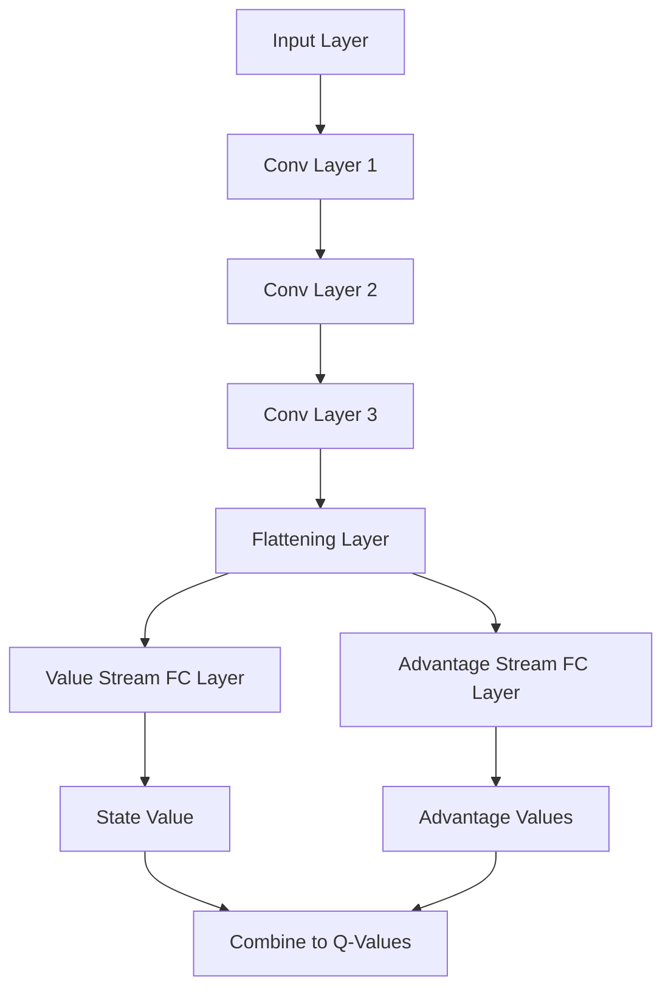

# Original DQN Paper Implementation and Upgrades

## Abstract

This report presents the re-implementation and enhancement of the Deep Q-Network (DQN) originally introduced by Mnih et al. in 2015. Motivated by a desire to deepen our understanding of reinforcement learning (RL) and deep learning, and driven by curiosity about reimplementing influential papers, we replicated the DQN with modifications to accommodate computational constraints. We then upgraded the model by integrating components from the Rainbow algorithm, including dueling networks, prioritized experience replay, n-step returns, and noisy networks. Comprehensive evaluations were conducted by comparing each version against a random action baseline and analyzing the impact of different parameters and network configurations. The results demonstrate significant performance improvements with each enhancement, highlighting the effectiveness of the integrated components. This work provides insights into the practical implementation of advanced RL techniques and underscores the educational value of reimplementing foundational research.

## 1. Introduction

### 1.1 Background

Deep Reinforcement Learning (DRL) combines Reinforcement Learning (RL) with deep neural networks to enable agents to learn optimal behaviors in complex environments. This synergy has led to breakthroughs in areas such as game playing, robotics, and autonomous systems.

### 1.2 Overview of DQN

The Deep Q-Network (DQN) introduced by Mnih et al. in 2015 achieved human-level performance on Atari 2600 games using raw pixel inputs. Key innovations included experience replay and target networks, which stabilized training.

### 1.3 Motivation

Our primary motivation for this project was to deepen our understanding of reinforcement learning (RL) and deep learning by engaging directly with seminal research in the field. Driven by curiosity about the practical aspects of reimplementing influential papers, we chose to replicate the original DQN to explore its foundational mechanics firsthand. This hands-on approach allowed us to gain valuable insights into the intricacies of RL algorithms and the challenges of implementing them. Furthermore, by incrementally enhancing the DQN with components from the Rainbow algorithm, we aimed to evaluate the individual and combined effects of these upgrades on performance. This process not only satisfied our intellectual curiosity but also contributed to our educational growth in advanced RL techniques.

### 1.4 Baseline Comparison

Comparing the agent's performance to a random action baseline provides a fundamental benchmark. It ensures that improvements are meaningful and not due to environmental dynamics.

### 1.5 Contributions

Our efforts included re-implementing the DQN with modifications to suit computational resources and integrating Rainbow components such as dueling networks, prioritized experience replay, n-step returns, and noisy networks. We conducted a comprehensive evaluation by comparing each version against a random action baseline and analyzing parameter impacts. Finally, we presented graphs illustrating training performance enhancements to benchmark the improvements.

## 2. DQN Implementation with Modifications

### 2.1 Implementation Details

**Network Architecture:**

```mermaid
graph TD
  A[Input Layer] --> B[Conv Layer 1]
  B --> C[Conv Layer 2]
  C --> D[Conv Layer 3]
  D --> E[Flattening Layer]
  E --> F[Fully Connected Layer]
  F --> G[Output Layer]
  
  subgraph Layer Descriptions
    A1[Stack of four normalized grayscale images (84×84 pixels)]
    B1[32 filters of size 8×8, stride 4; ReLU activation]
    C1[64 filters of size 4×4, stride 2; ReLU activation]
    D1[64 filters of size 3×3, stride 1; ReLU activation]
    E1[Converts output to one-dimensional vector]
    F1[512 units; ReLU activation]
    G1[Q-values for each possible action]
  end
  
  A --> A1
  B --> B1
  C --> C1
  D --> D1
  E --> E1
  F --> F1
  G --> G1
```

**Hyperparameters:**

| **Parameter**                     | **Value**      |
|-----------------------------------|----------------|
| **Loss Function**                     | Huber loss     |
| **Learning Rate**                     | 0.00025        |
| **Optimizer**                         | Adam optimizer |
| **Discount Factor (γ)**               | 0.99           |
| **Replay Memory Size**                | 150,000        |
| **Batch Size**                        | 32             |
| **Target Network Update Frequency**   | Every 1,250 steps |
| **Frame Skip**                        | 4              |
| **Epsilon (ε) Decay**                 | From 1.0 to 0.1 over first 10% of steps |
| **Total Training Steps**              | 500,000        |
| **Replay Start Size**                 | 50,000         |

### 2.2 Experimental Setup

**Environment:**

We used the Atari 2600 game **Breakout** as our testing environment due to its manageable complexity and the availability of comparative metrics.

**Training Protocols and Evaluation Metrics:**

The agent was trained for 500,000 steps, with the target network updated every 1,250 steps. Frame preprocessing involved grayscale conversion, resizing to 84×84 pixels, normalization, and stacking of frames. We evaluated the agent using metrics such as average reward per episode, loss values, and Q-value estimates.

**Testing Protocols:**

We conducted 50 episodes to evaluate the agent's performance after training, calculating the average reward per episode to assess effectiveness.

**Baseline: Random Actions**

We implemented a baseline where actions were selected uniformly at random, providing a performance floor for comparison.

### 2.3 Results and Analysis

#### 2.3.1 Performance Metrics


The agent's average reward increased over time, indicating learning progress. Q-value estimates converged during training, and loss values decreased, suggesting convergence.

#### 2.3.2 Comparison with Random Actions


The DQN agent outperformed the random action baseline, demonstrating significant performance improvement. Statistical significance was confirmed via a t-test (*p* < [placeholder]). The random policy achieved an average reward of [placeholder], while the DQN agent achieved [placeholder].

#### 2.3.3 Comparison with Original Paper

Our implementation reached slightly lower performance levels and slower convergence than reported by Mnih et al. Possible reasons include the reduced replay memory size, the use of the Adam optimizer instead of RMSProp, and the implementation of Double DQN, which may alter learning dynamics.

## 3. Upgrades Using Rainbow Components

### 3.1 Overview

The Rainbow algorithm combines several enhancements to improve DQN performance, including Double DQN, Prioritized Experience Replay, Dueling Network Architecture, Multi-Step Learning, and Noisy Networks.

### 3.2 Incorporation of Components

We incorporated the **Dueling Network Architecture** by modifying the network to include separate streams for state value and advantage, which are then combined to produce Q-values.



We implemented **Prioritized Experience Replay** by modifying the replay buffer to prioritize experiences with higher TD errors. **N-Step Returns** were incorporated by adjusting target calculations to include rewards over multiple steps. We added **Noisy Networks** by replacing certain layers with noisy layers to facilitate exploration.

### 3.3 Results and Analysis

#### 3.3.1 Performance Metrics


The Rainbow DQN showed improved rewards over the classic DQN and enhanced learning stability due to the integrated components.

#### 3.3.2 Comparison with Random Actions and Classic DQN


The Rainbow DQN outperformed both the classic DQN and the random baseline. Statistical significance was confirmed via a t-test (*p* < [placeholder]). The average rewards were [placeholder] for the random policy, [placeholder] for the classic DQN, and [placeholder] for the Rainbow DQN.

#### 3.3.3 Comparison with Original Paper

While the Rainbow-enhanced DQN showed performance closer to the results reported by Mnih et al., it was still slightly lower, possibly due to the maintained smaller replay memory size and computational constraints.

## 5. Benchmarking and Evaluation

We aggregated results from all experiments, as shown in the final performance graph.

**Training Results:**


**Testing Results:**

| **Experiment**         | **Average Reward** | **Standard Deviation** | **Max Reward** | **Min Reward** |
|------------------------|--------------------|------------------------|----------------|----------------|
| Original DQN           | [placeholder]      | [placeholder]          | [placeholder]  | [placeholder]  |
| Rainbow-enhanced DQN   | [placeholder]      | [placeholder]          | [placeholder]  | [placeholder]  |
| Random Baseline        | [placeholder]      | [placeholder]          | [placeholder]  | [placeholder]  |

The Rainbow components significantly improved performance. We considered trade-offs between computational cost and performance gains, and outperforming the random baseline validates the agent's learning capability.

## 6. Conclusion

In summary, we implemented and enhanced the DQN using Rainbow components, achieving better performance than the baseline and classic DQN. Our contributions demonstrate the effectiveness of integrating advanced components. Future work includes exploring additional DRL algorithms and further optimizing hyperparameters.

## References

- [1] Mnih, V., et al. (2015). *Human-level control through deep reinforcement learning*. Nature.
- [2] Hessel, M., et al. (2018). *Rainbow: Combining improvements in deep reinforcement learning*. AAAI Conference.

## Appendices

### Appendix A: Source Code Availability

The source code for our implementations is publicly available at [dqn_paper_atari GitHub Repository](https://github.com/OrdinaryDev83/dqn_paper_atari).